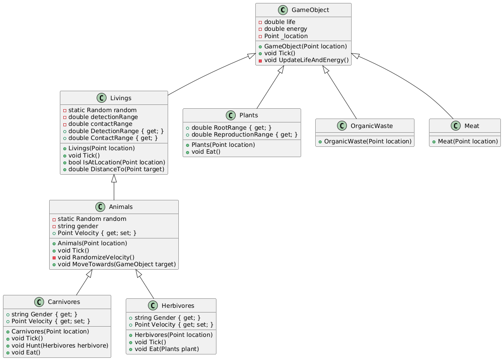
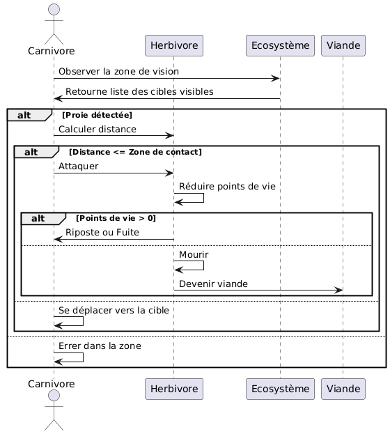
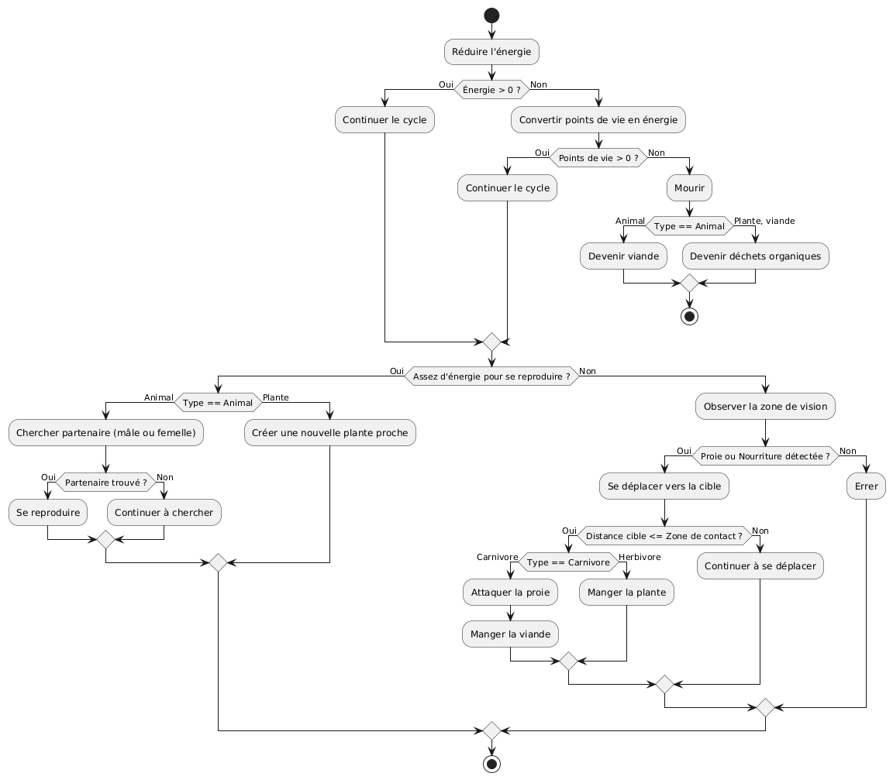

> RAPPORT DU PROJET ÉCOSYSTÈME
>
> 3bepo30 Software engineering 1
>
> Auteurs : Arifcan YILDIRIM 20144, Ibrahim AMGHAR 23374
>
> Enseignant : Quentin LURKIN
>
> Année académique 2024-2025

-------------

Table des matières

1 Diagramme de classe 

2 Diagramme de séquence 

3 Diagramme d’activité 

4 Principes Solid 

-------------
1 Diagramme de classe

> FIGURE 1 – Diagramme de classe

2 Diagramme de séquence 

> FIGURE 2 – Diagramme de séquence

3 Diagramme d’activité 

> FIGURE 3 – Diagramme d’activité

-------------

4 Principes Solid

Lors de la conception et du développement du projet, nous avons adopté
les principes SOLID pour garantir un code maintenable et extensible.

> Ce chapitre se concentre sur deux principes SOLID respectées dans le
> projet : — Principe de responsabilité unique (SRP)
>
> — Principe d’ouverture/fermeture (OCP)

1\. Principe de Responsabilité Unique (SRP)

1.1. Définition

Le principe de responsabilité unique stipule qu’une classe doit avoir
une seule raison de changer. Cela signifie qu’une classe doit se
concentrer sur une seule fonctionnalité ou responsabilité bien définie
dans le système.

L’avantagedeceprincipeestd’améliorerlacohésiondesclassesetderéduireleurcouplageavecd’autrescom-posants.
Ainsi, les modifications apportées a une classe n’impactent pas
inutilement d’autres parties du système.

1.2. Application dans le projet

Dans notre projet, les classes respectent pleinement le principe SRP.
Par exemple, une classe responsable de la gestion de l’état des objets
de l’écosystème ne traite que des propriétés liées à la vie et l’énergie
de ces objets.

Chaqueclasseseconcentresuruneseuleresponsabilité,commelamiseàjourdelapositionoudel’étatinterne
des objets, sans intervenir dans d’autres aspects comme l’affichage ou
la gestion des interactions entre objets.

En isolant les responsabilités de cette manière, nous assurons que les
modifications apportées à une fonction-nalité précise n’affectent pas le
reste du système. Chaque classe est simple à comprendre, à tester et à
maintenir.

> En respectant le principe SRP, nous avons obtenu les avantages
> suivants : — Une meilleure lisibilité et compréhension du code.
>
> — Une facilité accrue de maintenance et d’évolution du code, car
> chaque classe remplit une fonction claire et unique.
>
> — Une réduction des risques d’erreurs lors de l’ajout de nouvelles
> fonctionnalités.

2\. Principe d’Ouverture/Fermeture (OCP)

2.1. Définition

Le principe d’ouverture/fermeture stipule qu’une classe doit être
ouverte a l’extension mais fermée à la modi-fication. Cela signifie que
nous devons pouvoir ajouter de nouvelles fonctionnalités a une classe
sans modifier son code source existant.

Ce principe favorise l’extensibilité du système tout en préservant sa
stabilité, car il permet d’ajouter de nou-velles fonctionnalités sans
altérer les classes existantes, réduisant ainsi les risques de
régression.

2.2. Application dans le projet

Dansnotreprojet,lesclassesabstraitesjouentunrôlecrucialdanslerespectduprincipeOCP.Parexemple,une
classe abstraite d’animaux permet de définir des comportements
génériques tout en offrant la possibilité d’ajouter de nouveaux types
d’animaux sans modifier le code existant.

Les spécificités des différents types d’animaux sont implémentées dans
des sous-classes dérivées, permettant ainsi d’ajouter des
fonctionnalités sans toucher à la classe de base.

Ce respect du principe d’ouverture/fermeture permet :

— D’ajouter de nouvelles fonctionnalités sans régression sur le code
existant. — De maintenir un code stable tout en le faisant évoluer
facilement.

— De favoriser la modularité et la réutilisation des composants.

En respectant le principe d’ouverture/fermeture, nous avons obtenu les
avantages suivants :

— Une extensibilité accrue : il est facile d’ajouter de nouveaux types
d’objets en créant simplement de nou-velles sous-classes.

— Une réduction des risques de régression : les classes existantes
restent inchangées, ce qui limite les effets de bord.

— Un code plus modulaire et réutilisable.

